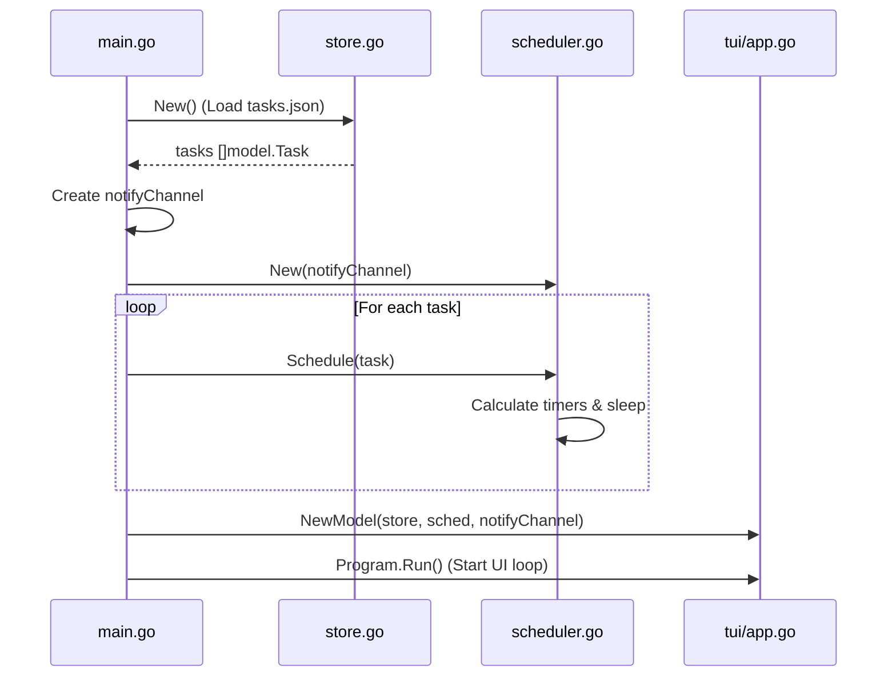
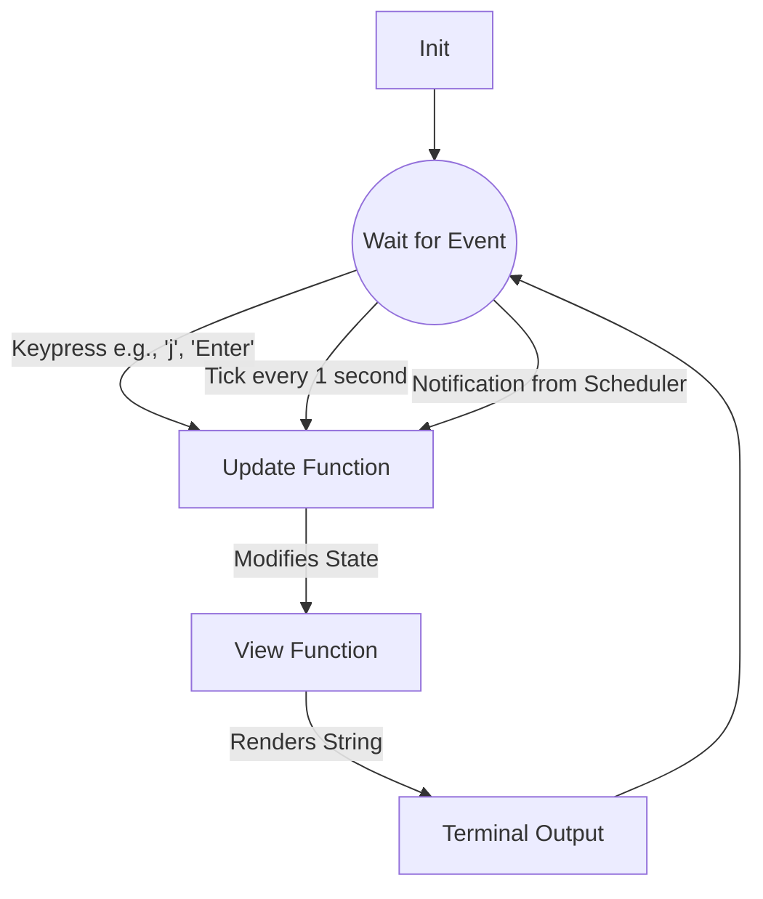
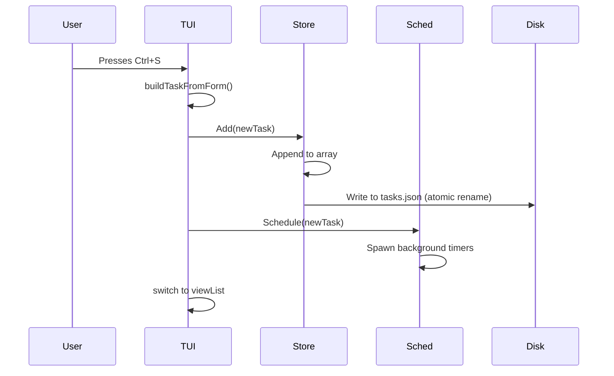

# Task Scheduler TUI — Architecture Walkthrough

This document explains exactly how the Go Task Scheduler TUI works under the hood. It covers the core components, how they interact, and maps out the flow of data using flowcharts.

## 1. High-Level Architecture

The application is built using a clean architecture pattern with three main pillars:

1. **Store (`internal/store/store.go`)**: Handles reading and writing tasks to the JSON file on disk. It uses a `sync.RWMutex` to ensure that reading and saving tasks from different parts of the app (like the UI and background threads) doesn't cause data corruption.
2. **Scheduler (`internal/scheduler/scheduler.go`)**: Manages background goroutines (lightweight threads) and timers. Instead of constantly checking the time in a loop (like the Java version), it calculates exactly how long to wait until a reminder or deadline, and sleeps until then using Go's highly efficient `time.AfterFunc`.
3. **UI (`internal/tui/app.go`)**: Built with **Bubble Tea** (The Elm Architecture). It manages the terminal rendering, user inputs, and navigation.

---

## 2. Startup Flow (What happens when you run `./taskscheduler`)

Everything starts in `cmd/taskscheduler/main.go`.



1. **Initialize Store**: Reads `~/.config/taskscheduler/tasks.json` into memory.
2. **Initialize Channel**: Creates a Go Channel (`notifyCh`) for the background scheduler to send messages to the UI safely.
3. **Boot Scheduler**: Passes all loaded tasks into the scheduler so it can set up the timers for any pending deadlines or reminders.
4. **Start UI**: Passes the store, scheduler, and channel into the Bubble Tea `Model` and launches the interactive terminal screen.

---

## 3. The Bubble Tea Loop (How the UI works)

Bubble Tea uses the **Elm Architecture**, an infinite loop of three functions:

- `Init()`: Fires once on startup (sets up a 1-second clock tick and listens for notifications).
- `Update(msg)`: Called whenever an "event" happens (e.g., a key is pressed, a second passes, a reminder triggers). It updates the `Model` (the state of the app) and returns it.
- `View()`: Called after `Update()`. It takes the current `Model` and returns a string (the styled text that gets drawn to the terminal).



### Example: Pressing 'a' to Add a Task
1. You press `a`.
2. `Update()` receives a `tea.KeyMsg` for 'a'.
3. `Update()` changes `m.view` from `viewList` to `viewAdd` and focuses the first input field.
4. `View()` sees that `m.view == viewAdd` and renders the form instead of the list.

---

## 4. User Interaction: Saving a Task

What happens when you finish filling out the form and hit `Ctrl+S`?



1. The TUI reads all the text inputs, parses numbers, and builds a `model.Task` struct.
2. It sends this to `store.Add()`. The store locks its mutex, appends the task, writes a temporary `.json` file to disk, and atomically renames it over the old one (preventing data loss if it crashes mid-save).
3. The TUI tells the `Scheduler` to start tracking this task.
4. The UI jumps back to the main list.

---

## 5. Background Scheduling (The "Magic")

How do reminders and deadlines pop up on the screen while you are typing or looking at the list?

```mermaid
flowchart TD
    Timer((time.AfterFunc Timer)) -->|Time expires!| Func[Trigger Function]
    Func -->|Send struct| Channel[notifyCh channel]
    Channel -->|BubbleTea command reads channel| Update[Update() in UI]
    Update -->|Update m.notification string| View[View()]
    View -->|Render NotificationPanel| Screen
```

When you call `scheduler.Schedule(task)`:
1. It calculates how many nanoseconds until the task's deadline or reminder.
2. It calls `time.AfterFunc(duration, function)`, which tells the Go runtime: *"Wake up this function after `duration` passes."* This is incredibly cheap and uses 0% CPU while waiting.
3. When the time comes, the function executes and sends a `scheduler.Notification` struct into the `notifyCh` channel.
4. The Bubble Tea UI is constantly listening to this channel via the `waitForNotification()` command. When it receives the struct, it updates `m.notification` and re-renders the screen, showing the yellow notification box at the bottom.

---

## 6. Where everything lives (File Guide)

- **`internal/model/task.go`**: The blueprints. Defines the `Task` struct, `Priority`, `Status`, and helper methods like `IsOverdue()`. This holds data, not behavior.
- **`internal/tui/theme/theme.go`**: The paint. Uses `lipgloss` to define colors, margins, borders, and styles so the app looks pretty. Keeps hardcoded colors out of the main logic.
- **`internal/tui/app.go`**: The brain. Contains the `Model` struct, the `Update()` switch statement (which handles all keyboard logic), and the `View()` functions (which draw the screen).
- **`internal/store/store.go`**: The hard drive. Handles JSON unmarshaling/marshaling and concurrency locks.
- **`internal/scheduler/scheduler.go`**: The alarm clock. Manages `time.Timer` arrays so they can be triggered or cancelled (e.g., if you delete a task, you want its alarms cancelled).
